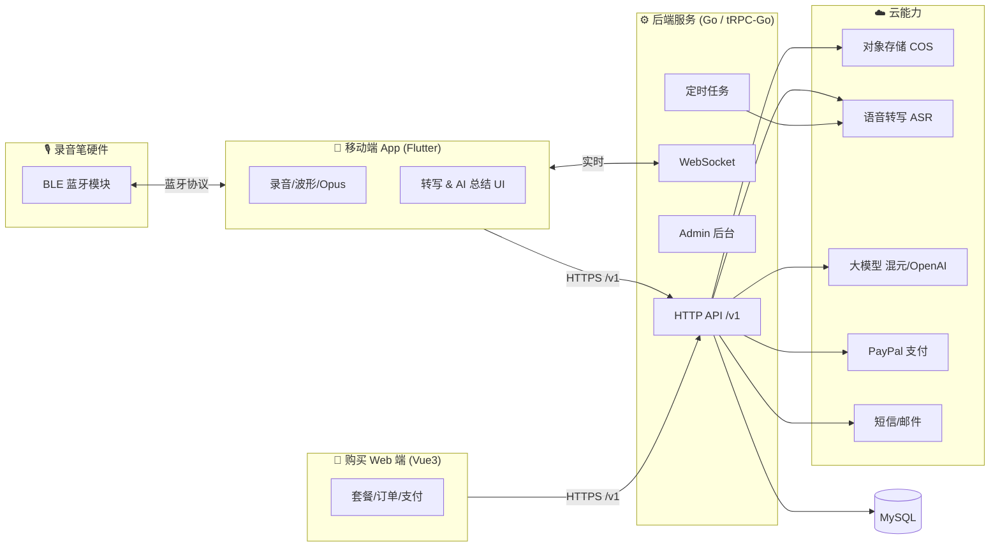

<div align="center">

# 🎙️ AiRecord · 开源 AI 录音笔平台

**一套完整、可商用的「AI 录音笔」全栈解决方案 —— 蓝牙硬件接入 · 云端语音转写 · 大模型智能总结 · 多语言 · 订阅付费**

*A complete, production-grade full-stack platform for AI-powered voice recorders — BLE hardware, cloud ASR, LLM summarization, i18n and subscription billing.*

[](./LICENSE)
[](./CONTRIBUTING.md)


[简体中文](#-项目简介) · [English](#-english) · [快速开始](#-快速开始) · [架构](#-系统架构) · [路线图](#-路线图-roadmap) · [贡献](./CONTRIBUTING.md)

</div>

---

## 📖 项目简介

**AiRecord** 是一个面向「AI 录音笔 / 智能录音」场景的**开源全栈平台**。它不仅仅是一个 App，而是覆盖 **硬件接入 → 录音采集 → 云端存储 → 语音转写 → 大模型总结 → 商业变现** 全链路的完整工程实践。

无论你是想：

- 🔧 **做硬件的团队** —— 快速拥有一套配套的 App + 云服务，专注打磨录音笔硬件；
- 🚀 **做 AI 应用的开发者** —— 直接复用一套经过打磨的语音 + LLM 工程骨架；
- 🎓 **学习全栈架构的工程师** —— 参考一套 Flutter + Go DDD + Vue 的真实商用代码；

AiRecord 都能给你一个**开箱即用的起点**。

> 💡 项目已在真实业务中打磨迭代，包含完整的用户体系、套餐订阅、支付、多语言等商业化能力。现开源，期待与更多开发者、硬件厂商、AI 团队合作共建。

---

## ✨ 核心特性

### 📱 移动端 App（Flutter）
- **蓝牙录音笔接入**：基于 BLE 与录音笔硬件通信（自定义通信协议，见 `docs/`），支持设备连接、电量、文件同步。
- **本地录音 & 音频处理**：Opus 编解码、实时波形可视化、音频会话管理。
- **云端语音转写（ASR）**：录音上传对象存储后触发云端转写，展示带时间轴的文字稿。
- **AI 智能总结**：接入大模型对转写结果做摘要、要点提取、对话问答。
- **多语言国际化**：内置 **17 种语言**（中/繁/英/日/韩/法/德/西/葡/阿/印尼/马来/泰/越/菲/土/印地）。
- **完整用户体系**：邮箱/验证码登录注册、套餐余额、订单、个人中心。

### ⚙️ 后端服务（Go · tRPC-Go · DDD）
- **领域驱动分层架构**：`interfaces / application / domain / infrastructure / admin` 清晰解耦。
- **多云 AI 能力适配**：腾讯云 ASR、腾讯混元、Azure OpenAI/OpenAI，可插拔切换。
- **对象存储**：腾讯云 COS，临时密钥直传，安全可控。
- **支付与订阅**：集成 PayPal 订单与订阅（沙箱/生产可切换）。
- **消息通道**：WebSocket 实时推送 + 定时任务调度（转写状态轮询）。
- **内置 Admin 后台**：Vue 编写的管理端，用户/订单/套餐管理。

### 🛒 购买 Web 端（Vue 3 · Vite）
- 邮箱登录/注册/找回密码、套餐购买、订单管理、PayPal 结账。
- 为规避应用商店内购限制而设计的独立 Web 收银台，与后端 API 完全复用。

---

## 🏗️ 系统架构



---

## 🧩 仓库结构

| 模块 | 目录 | 技术栈 | 说明 |
| --- | --- | --- | --- |
| 📱 移动端 App | [`airecordapp/`](./airecordapp) | Flutter / Dart | iOS & Android 录音笔配套 App |
| ⚙️ 后端服务 | [`airecodeserver/`](./airecodeserver) | Go · tRPC-Go · GORM · Vue(admin) | API / WebSocket / Admin / 定时任务 |
| 🛒 购买 Web 端 | [`airecodeshop/`](./airecodeshop) | Vue 3 · Vite · Element Plus | 套餐购买与支付 |
| 📄 文档 | [`docs/`](./docs) | Markdown | BLE 通信协议、设计文档等 |

---

## 🚀 快速开始

> 前置：所有真实密钥均**未包含**在仓库中，请先从 `*.example` 复制配置并填入你自己的凭证。

### 1️⃣ 后端服务（airecodeserver）

```bash
cd airecodeserver

# 1. 生成配置（填入你的腾讯云 / OpenAI / PayPal / MySQL / SMTP 凭证）
cp conf/ai_record_server.example.yaml conf/ai_record_server.yaml
cp conf/trpc_go.example.yaml conf/trpc_go.yaml

# 2. （可选）生成自签 TLS 证书到 conf/ssl/，或在 trpc_go.yaml 中关闭 TLS
#    openssl req -x509 -newkey rsa:2048 -keyout conf/ssl/server.key \
#      -out conf/ssl/server.crt -days 3650 -nodes

# 3. 准备 MySQL 数据库 ai_record_db，并配置连接串

# 4. 编译运行
sh build.sh          # 产物在 ./bin
cd bin && ./ai_record_server -conf ../conf/trpc_go.yaml
```

### 2️⃣ 移动端 App（airecordapp）

```bash
cd airecordapp
flutter pub get

# Android 出包前：自行生成 keystore，并通过环境变量注入签名密码
#   ANDROID_KEYSTORE_PASSWORD / ANDROID_KEY_ALIAS / ANDROID_KEY_PASSWORD

flutter run                    # 调试
flutter build apk --release    # Android 出包
flutter build ipa --release    # iOS 出包
```

> 🔑 App 中调用后端的域名与 AI 密钥请在对应配置/代码处替换为你自己的值。

### 3️⃣ 购买 Web 端（airecodeshop）

```bash
cd airecodeshop
npm install
cp .env.example .env.local     # 填入你的后端域名 VITE_API_BASE
npm run dev                     # http://localhost:5174/shop/
npm run build                   # 产物在 dist/
```

---

## 🗺️ 路线图 Roadmap

- [ ] 补充英文版完整文档与 API 参考
- [ ] 提供 `docker-compose` 一键启动后端 + MySQL
- [ ] 抽象 ASR / LLM / 支付为标准接口，方便接入更多厂商（讯飞、阿里、DeepSeek、Stripe…）
- [ ] 提供设备端固件示例与完整 BLE 协议开放规范
- [ ] Web 管理后台功能增强与权限体系
- [ ] 单元测试与 CI（GitHub Actions）覆盖

> 欢迎在 Issues 中提出你的需求与想法，或直接提交 PR！

---

## 🤝 参与共建 & 合作

我们非常欢迎各种形式的合作：

- ⭐ **Star** 本仓库，让更多人看到它；
- 🐛 提交 **Issue** 反馈问题或提出建议；
- 🔀 提交 **Pull Request** 参与开发（见 [贡献指南](./CONTRIBUTING.md)）；
- 🏢 **商业合作**：硬件厂商、AI 能力方、渠道方，欢迎通过 Issue 或仓库主页联系方式与我们联系。

---

## 📜 许可协议

本项目基于 [MIT License](./LICENSE) 开源，可自由用于商业与非商业用途。
安全相关请参见 [SECURITY.md](./SECURITY.md)。

---

<a name="-english"></a>

## 🌍 English

**AiRecord** is an open-source, production-grade **full-stack platform for AI-powered voice recorders**. It covers the entire pipeline: **BLE hardware → recording → cloud storage → speech-to-text → LLM summarization → monetization**.

**What's inside:**

- 📱 **Mobile App** (`airecordapp/`, Flutter) — BLE recorder integration, Opus audio, waveform, cloud ASR, LLM summary, **17 languages**, full auth & subscription.
- ⚙️ **Backend** (`airecodeserver/`, Go / tRPC-Go, DDD) — REST API, WebSocket, cron jobs, pluggable ASR/LLM (Tencent Hunyuan, Azure/OpenAI), COS storage, PayPal billing, built-in Vue admin.
- 🛒 **Shop Web** (`airecodeshop/`, Vue 3 + Vite) — login, packages, orders, PayPal checkout.

**Why open source?** The project has been battle-tested in real business scenarios. We're opening it up to collaborate with developers, hardware vendors and AI teams.

> ⚠️ **No real secrets are included.** Copy every `*.example` config file and fill in your own credentials before running. See [Getting Started](#-快速开始) above and [SECURITY.md](./SECURITY.md).

Contributions are welcome — please read the [Contributing Guide](./CONTRIBUTING.md). Licensed under [MIT](./LICENSE).

---

<div align="center">

**如果这个项目对你有帮助，欢迎点一个 ⭐ Star 支持我们！**

*If you find this project useful, please consider giving it a ⭐!*

</div>
